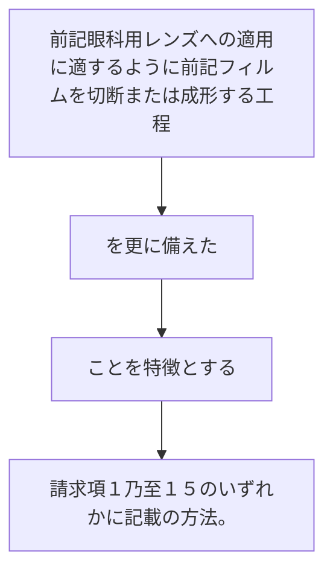

前記眼科用レンズへの適用に適するように前記フィルムを切断または成形する工程
を更に備えたことを特徴とする請求項１乃至１５のいずれかに記載の方法。

```mermaid
flowchart TD
A[前記眼科用レンズへの適用に適するように前記フィルムを切断または成形する工程]
B[を更に備えた]
C[ことを特徴とする]
D[請求項１乃至１５のいずれかに記載の方法。]
A --> B
B --> C
C --> D
```