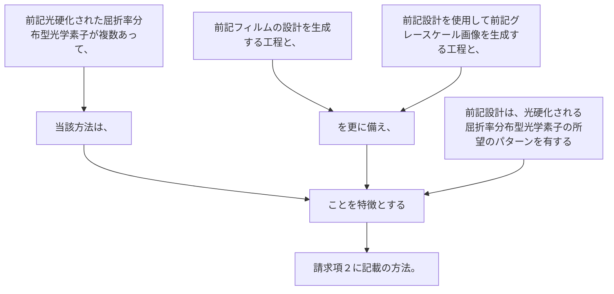

```mermaid
flowchart TD
A[前記光硬化された屈折率分布型光学素子が複数あって、]
B[当該方法は、]
C[前記フィルムの設計を生成する工程と、]
D[前記設計を使用して前記グレースケール画像を生成する工程と、]
E[を更に備え、]
F[前記設計は、光硬化される屈折率分布型光学素子の所望のパターンを有する]
G[ことを特徴とする]
H[請求項２に記載の方法。]
A --> B
B --> G
C --> E
D --> E
E --> G
F --> G
G --> H
```