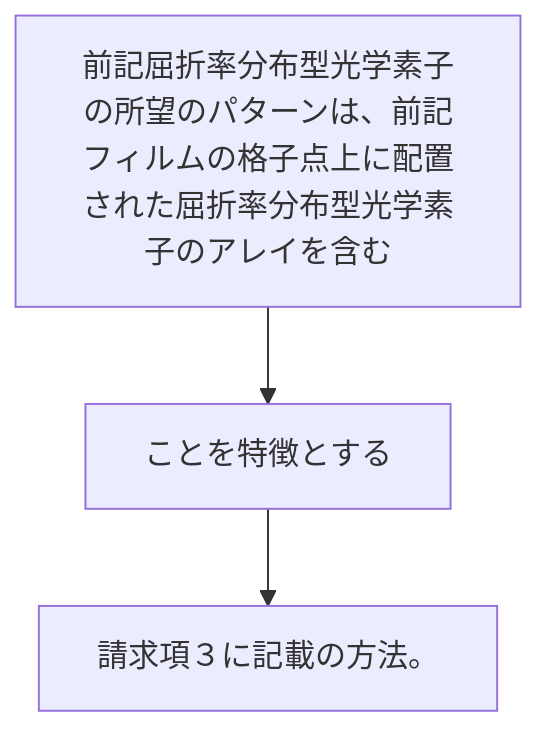

前記屈折率分布型光学素子の所望のパターンは、前記フィルムの格子点上に配置された屈折率分布型光学素子のアレイを含む
ことを特徴とする請求項３に記載の方法。

```mermaid
flowchart TD
A[前記屈折率分布型光学素子の所望のパターンは、前記フィルムの格子点上に配置された屈折率分布型光学素子のアレイを含む]
B[ことを特徴とする]
C[請求項３に記載の方法。]
A --> B
B --> C
```