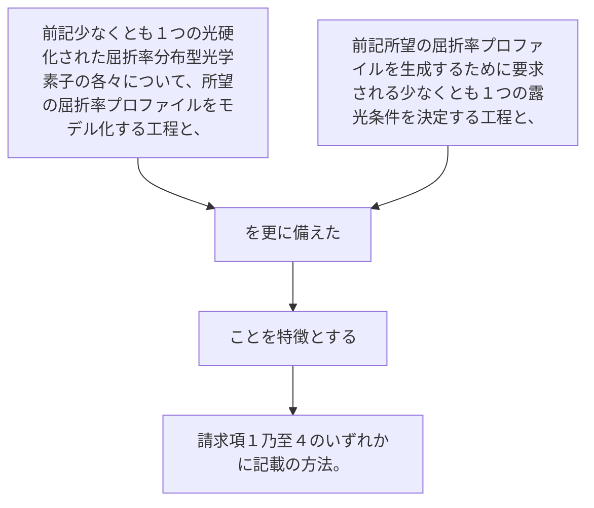

```mermaid
flowchart TD
A[前記少なくとも１つの光硬化された屈折率分布型光学素子の各々について、所望の屈折率プロファイルをモデル化する工程と、]
B[前記所望の屈折率プロファイルを生成するために要求される少なくとも１つの露光条件を決定する工程と、]
C[を更に備えた]
D[ことを特徴とする]
E[請求項１乃至４のいずれかに記載の方法。]
A --> C
B --> C
C --> D
D --> E
```