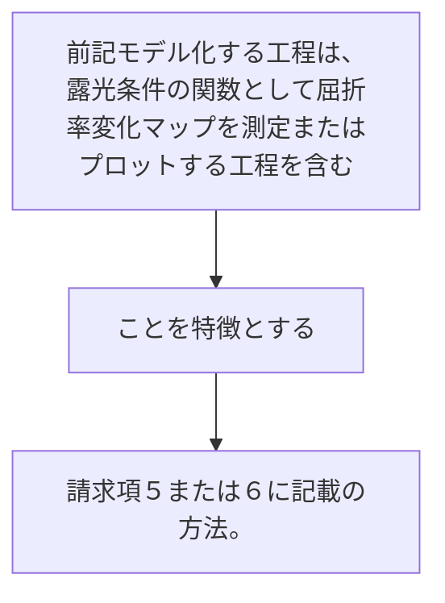

前記モデル化する工程は、露光条件の関数として屈折率変化マップを測定またはプロットする工程を含む
ことを特徴とする請求項５または６に記載の方法。

```mermaid
flowchart TD
A[前記モデル化する工程は、露光条件の関数として屈折率変化マップを測定またはプロットする工程を含む]
B[ことを特徴とする]
C[請求項５または６に記載の方法。]
A --> B
B --> C
```