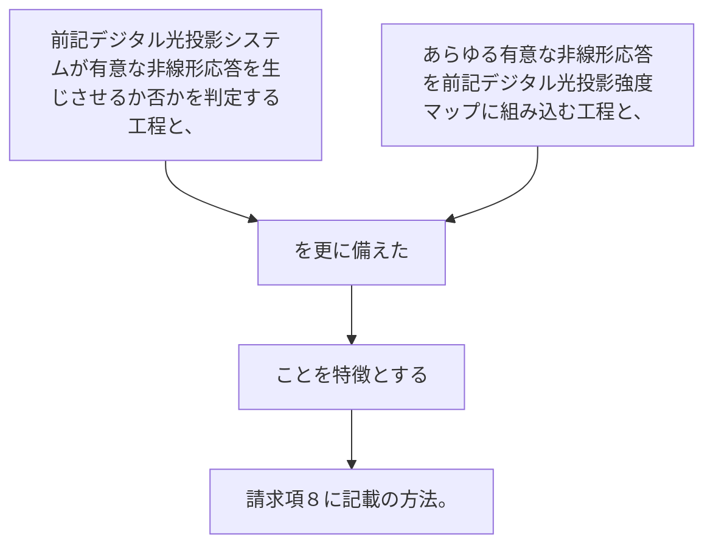

前記デジタル光投影システムが有意な非線形応答を生じさせるか否かを判定する工程と、
あらゆる有意な非線形応答を前記デジタル光投影強度マップに組み込む工程と、
を更に備えたことを特徴とする請求項８に記載の方法。

```mermaid
flowchart TD
A[前記デジタル光投影システムが有意な非線形応答を生じさせるか否かを判定する工程と、]
B[あらゆる有意な非線形応答を前記デジタル光投影強度マップに組み込む工程と、]
C[を更に備えた]
D[ことを特徴とする]
E[請求項８に記載の方法。]
A --> C
B --> C
C --> D
D --> E
```