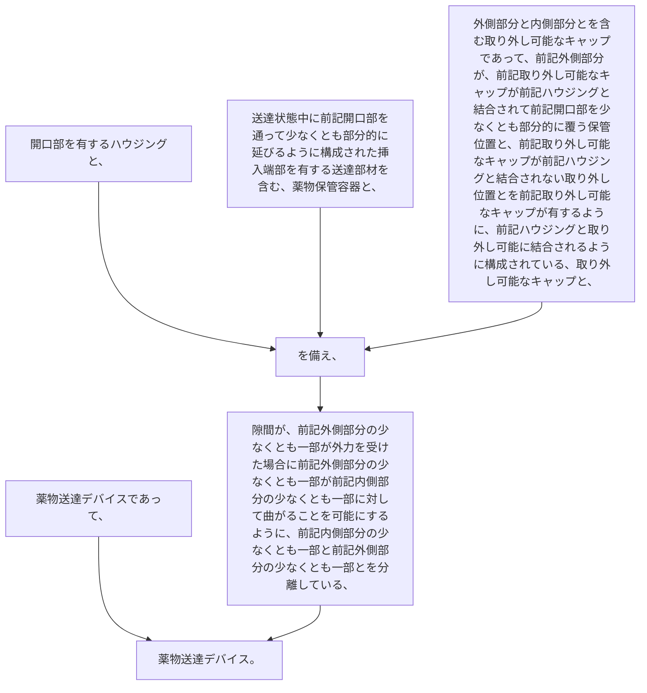

```mermaid
flowchart TD
A[薬物送達デバイスであって、]
B[開口部を有するハウジングと、]
C[送達状態中に前記開口部を通って少なくとも部分的に延びるように構成された挿入端部を有する送達部材を含む、薬物保管容器と、]
D[外側部分と内側部分とを含む取り外し可能なキャップであって、前記外側部分が、前記取り外し可能なキャップが前記ハウジングと結合されて前記開口部を少なくとも部分的に覆う保管位置と、前記取り外し可能なキャップが前記ハウジングと結合されない取り外し位置とを前記取り外し可能なキャップが有するように、前記ハウジングと取り外し可能に結合されるように構成されている、取り外し可能なキャップと、]
E[を備え、]
F[隙間が、前記外側部分の少なくとも一部が外力を受けた場合に前記外側部分の少なくとも一部が前記内側部分の少なくとも一部に対して曲がることを可能にするように、前記内側部分の少なくとも一部と前記外側部分の少なくとも一部とを分離している、]
G[薬物送達デバイス。]

A --> G
B --> E
C --> E
D --> E
E --> F
F --> G
```