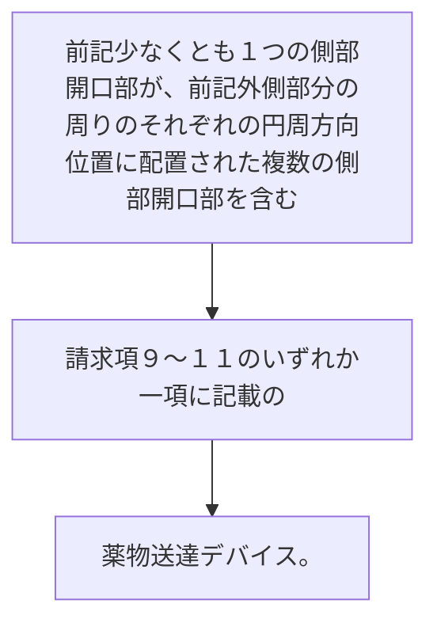

前記少なくとも１つの側部開口部が、前記外側部分の周りのそれぞれの円周方向位置に配置された複数の側部開口部を含む、請求項９～１１のいずれか一項に記載の薬物送達デバイス。

```mermaid
flowchart TD
A[前記少なくとも１つの側部開口部が、前記外側部分の周りのそれぞれの円周方向位置に配置された複数の側部開口部を含む]
B[請求項９～１１のいずれか一項に記載の]
C[薬物送達デバイス。]
A --> B
B --> C
```