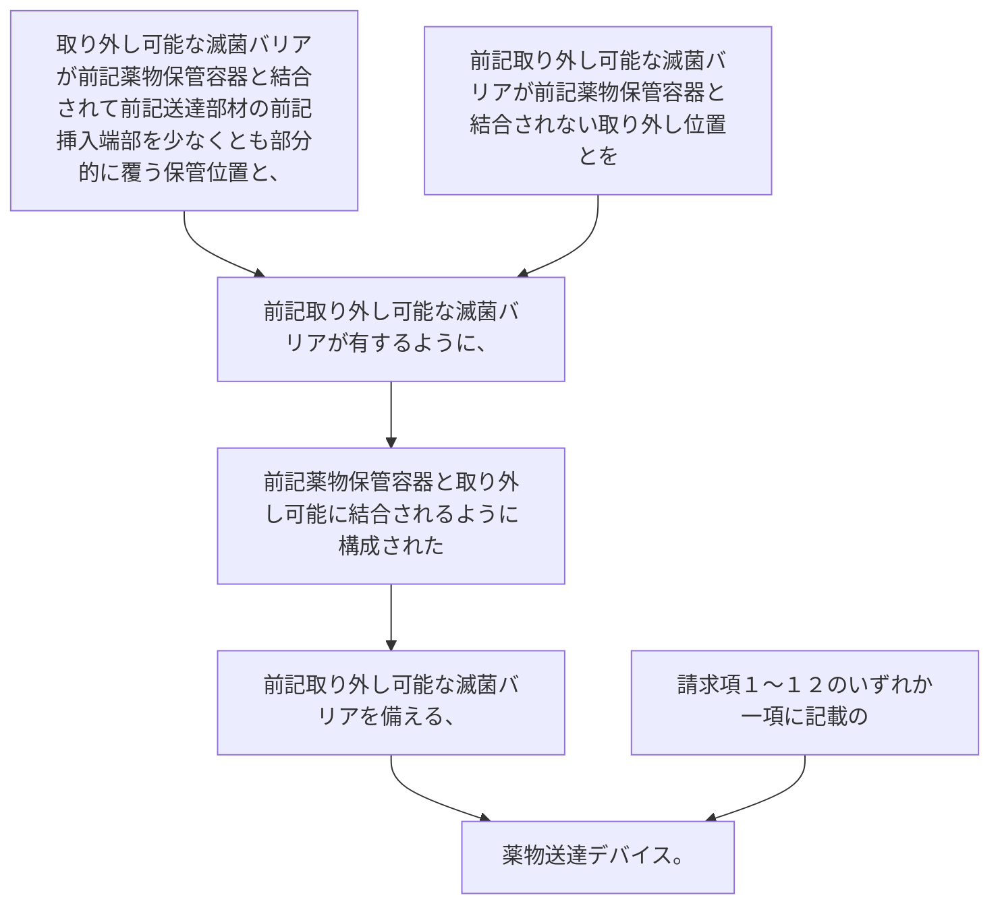

取り外し可能な滅菌バリアが前記薬物保管容器と結合されて前記送達部材の前記挿入端部を少なくとも部分的に覆う保管位置と、前記取り外し可能な滅菌バリアが前記薬物保管容器と結合されない取り外し位置とを前記取り外し可能な滅菌バリアが有するように、前記薬物保管容器と取り外し可能に結合されるように構成された前記取り外し可能な滅菌バリアを備える、請求項１～１２のいずれか一項に記載の薬物送達デバイス。

```mermaid
flowchart TD
A[取り外し可能な滅菌バリアが前記薬物保管容器と結合されて前記送達部材の前記挿入端部を少なくとも部分的に覆う保管位置と、]
B[前記取り外し可能な滅菌バリアが前記薬物保管容器と結合されない取り外し位置とを]
C[前記取り外し可能な滅菌バリアが有するように、]
D[前記薬物保管容器と取り外し可能に結合されるように構成された]
E[前記取り外し可能な滅菌バリアを備える、]
F[請求項１～１２のいずれか一項に記載の]
G[薬物送達デバイス。]
A --> C
B --> C
C --> D
D --> E
E --> G
F --> G
```