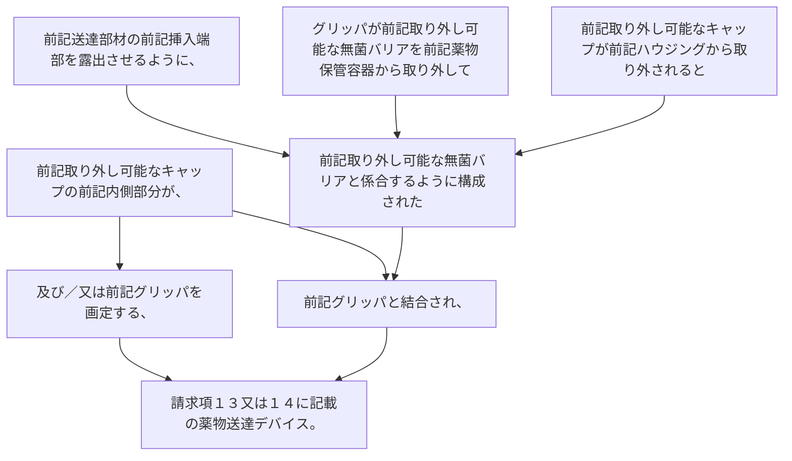

```mermaid
flowchart TD
A[前記取り外し可能なキャップの前記内側部分が、]
B[前記取り外し可能なキャップが前記ハウジングから取り外されると]
C[グリッパが前記取り外し可能な無菌バリアを前記薬物保管容器から取り外して]
D[前記送達部材の前記挿入端部を露出させるように、]
E[前記取り外し可能な無菌バリアと係合するように構成された]
F[前記グリッパと結合され、]
H[及び／又は前記グリッパを画定する、]
I[請求項１３又は１４に記載の薬物送達デバイス。]

A --> F
A --> H
B --> E
C --> E
D --> E
E --> F
F --> I
H --> I
```