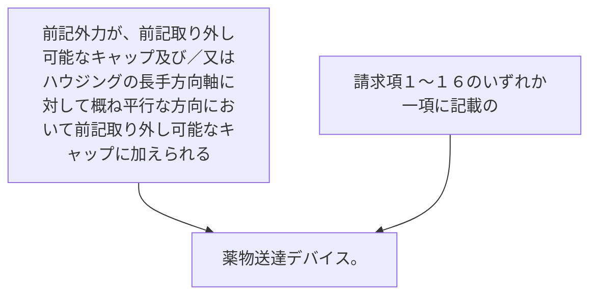

前記外力が、前記取り外し可能なキャップ及び／又はハウジングの長手方向軸に対して概ね平行な方向において前記取り外し可能なキャップに加えられる、請求項１～１６のいずれか一項に記載の薬物送達デバイス。

```mermaid
flowchart TD
A[前記外力が、前記取り外し可能なキャップ及び／又はハウジングの長手方向軸に対して概ね平行な方向において前記取り外し可能なキャップに加えられる]
B[請求項１～１６のいずれか一項に記載の]
C[薬物送達デバイス。]
A --> C
B --> C
```