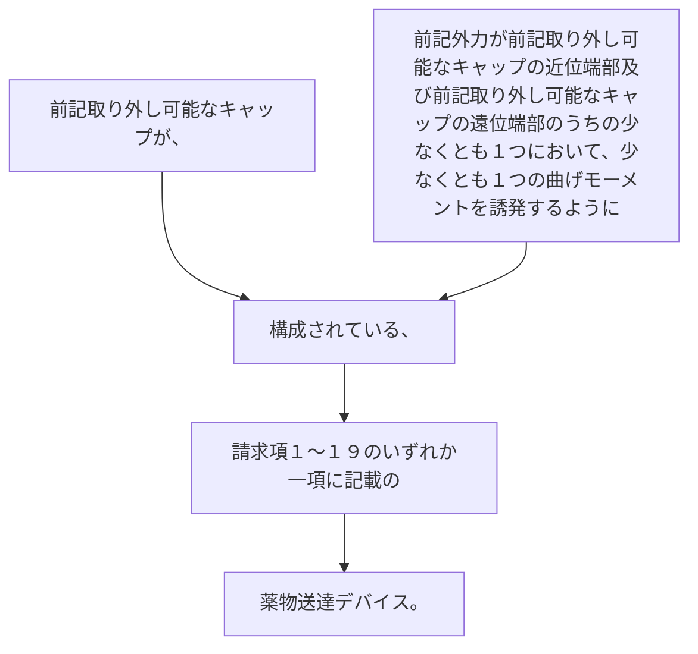

前記取り外し可能なキャップが、前記外力が前記取り外し可能なキャップの近位端部及び前記取り外し可能なキャップの遠位端部のうちの少なくとも１つにおいて、少なくとも１つの曲げモーメントを誘発するように構成されている、請求項１～１９のいずれか一項に記載の薬物送達デバイス。

```mermaid
flowchart TD
A[前記取り外し可能なキャップが、]
B[前記外力が前記取り外し可能なキャップの近位端部及び前記取り外し可能なキャップの遠位端部のうちの少なくとも１つにおいて、少なくとも１つの曲げモーメントを誘発するように]
C[構成されている、]
D[請求項１～１９のいずれか一項に記載の]
E[薬物送達デバイス。]
A --> C
B --> C
C --> D
D --> E
```