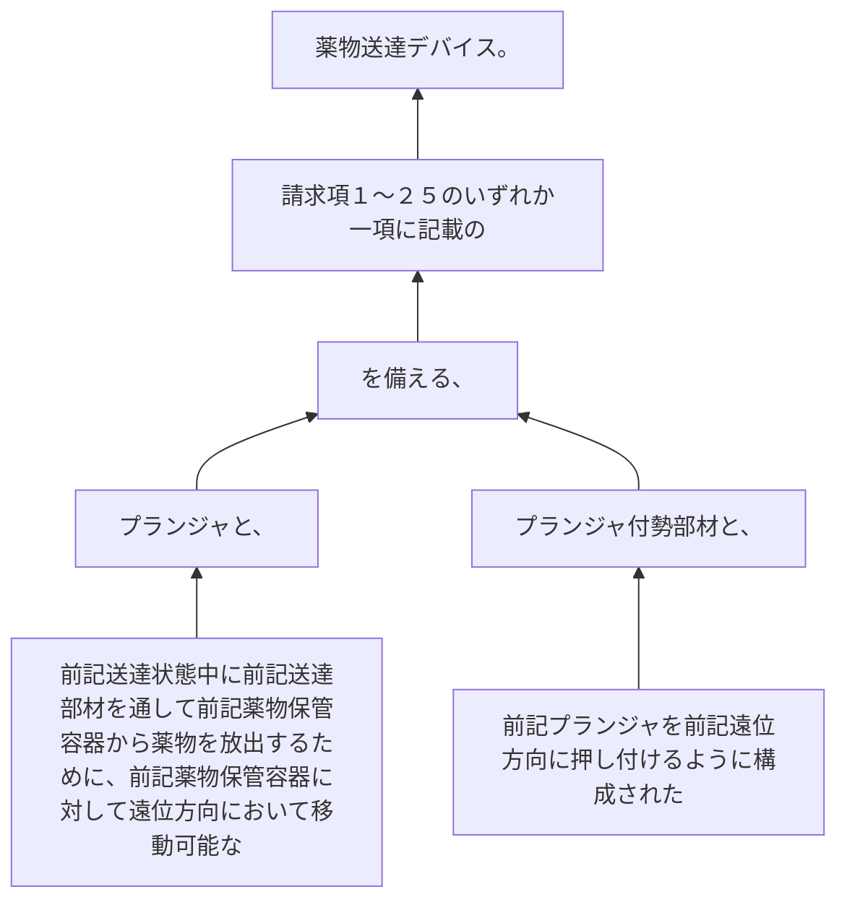

前記送達状態中に前記送達部材を通して前記薬物保管容器から薬物を放出するために、前記薬物保管容器に対して遠位方向において移動可能なプランジャと、
前記プランジャを前記遠位方向に押し付けるように構成されたプランジャ付勢部材と、
を備える、請求項１～２５のいずれか一項に記載の薬物送達デバイス。

```mermaid
flowchart BT
G[薬物送達デバイス。]
F[請求項１～２５のいずれか一項に記載の]
E[を備える、]
B[プランジャと、]
A[前記送達状態中に前記送達部材を通して前記薬物保管容器から薬物を放出するために、前記薬物保管容器に対して遠位方向において移動可能な]
D[プランジャ付勢部材と、]
C[前記プランジャを前記遠位方向に押し付けるように構成された]

A --> B
C --> D
B --> E
D --> E
E --> F
F --> G
```