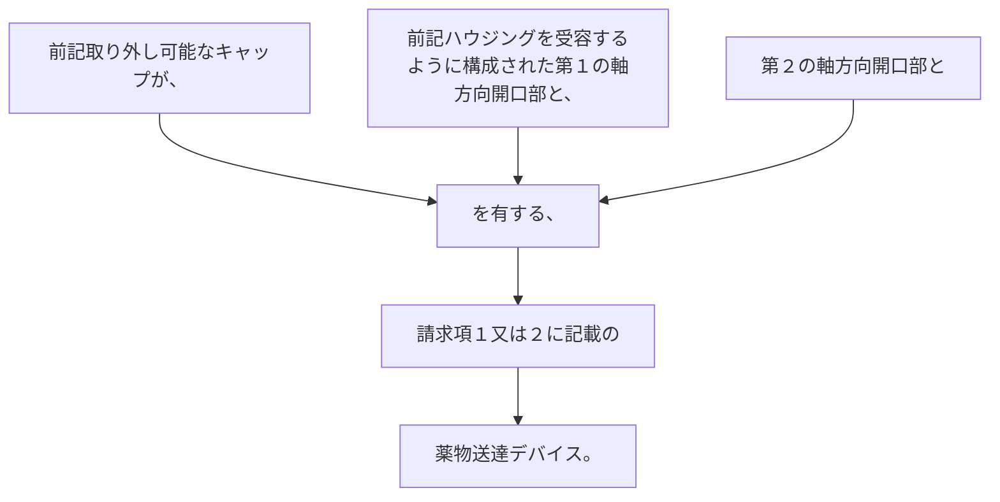

前記取り外し可能なキャップが、前記ハウジングを受容するように構成された第１の軸方向開口部と、第２の軸方向開口部とを有する、請求項１又は２に記載の薬物送達デバイス。

```mermaid
flowchart TD
A[前記取り外し可能なキャップが、]
B[前記ハウジングを受容するように構成された第１の軸方向開口部と、]
C[第２の軸方向開口部と]
D[を有する、]
E[請求項１又は２に記載の]
F[薬物送達デバイス。]
A --> D
B --> D
C --> D
D --> E
E --> F
```