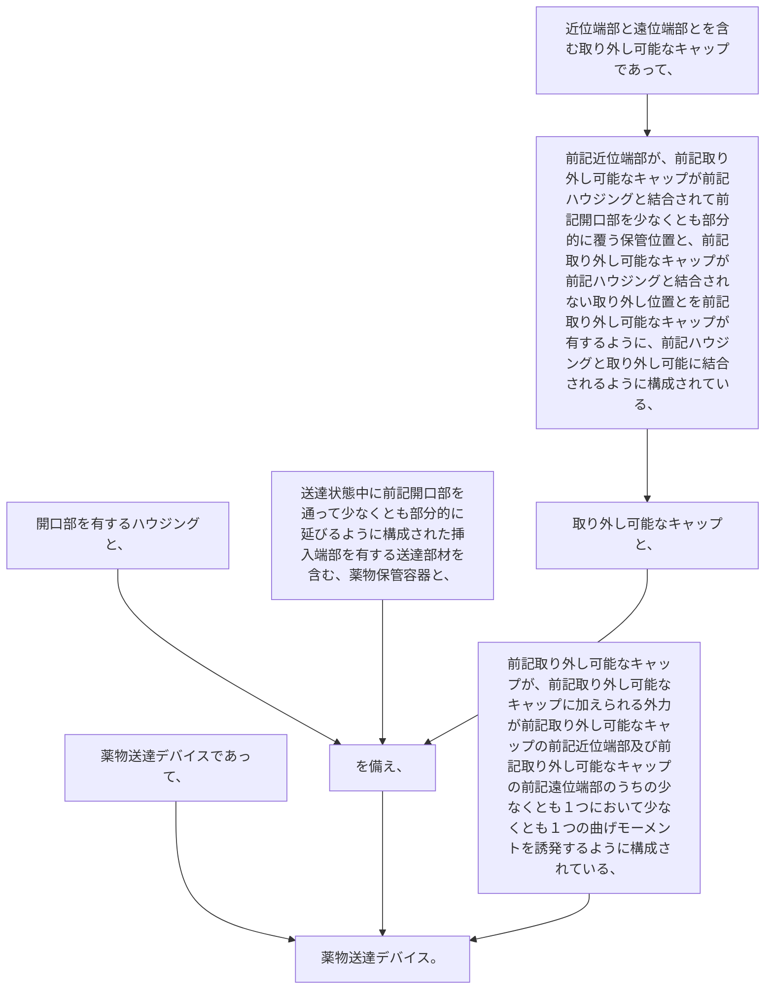

```mermaid
flowchart TD
A[薬物送達デバイスであって、]
B[開口部を有するハウジングと、]
C[送達状態中に前記開口部を通って少なくとも部分的に延びるように構成された挿入端部を有する送達部材を含む、薬物保管容器と、]
D[近位端部と遠位端部とを含む取り外し可能なキャップであって、]
E[前記近位端部が、前記取り外し可能なキャップが前記ハウジングと結合されて前記開口部を少なくとも部分的に覆う保管位置と、前記取り外し可能なキャップが前記ハウジングと結合されない取り外し位置とを前記取り外し可能なキャップが有するように、前記ハウジングと取り外し可能に結合されるように構成されている、]
F[取り外し可能なキャップと、]
G[を備え、]
H[前記取り外し可能なキャップが、前記取り外し可能なキャップに加えられる外力が前記取り外し可能なキャップの前記近位端部及び前記取り外し可能なキャップの前記遠位端部のうちの少なくとも１つにおいて少なくとも１つの曲げモーメントを誘発するように構成されている、]
I[薬物送達デバイス。]
A --> I
B --> G
C --> G
D --> E
E --> F
F --> G
G --> I
H --> I
```