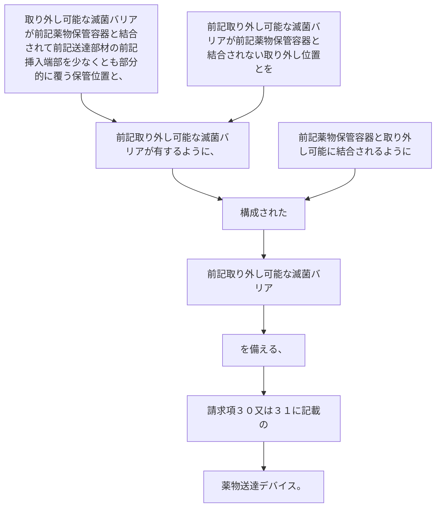

```mermaid
flowchart TD
A[取り外し可能な滅菌バリアが前記薬物保管容器と結合されて前記送達部材の前記挿入端部を少なくとも部分的に覆う保管位置と、]
B[前記取り外し可能な滅菌バリアが前記薬物保管容器と結合されない取り外し位置とを]
C[前記取り外し可能な滅菌バリアが有するように、]
D[前記薬物保管容器と取り外し可能に結合されるように]
E[構成された]
F[前記取り外し可能な滅菌バリア]
G[を備える、]
H[請求項３０又は３１に記載の]
I[薬物送達デバイス。]

A --> C
B --> C
C --> E
D --> E
E --> F
F --> G
G --> H
H --> I
```