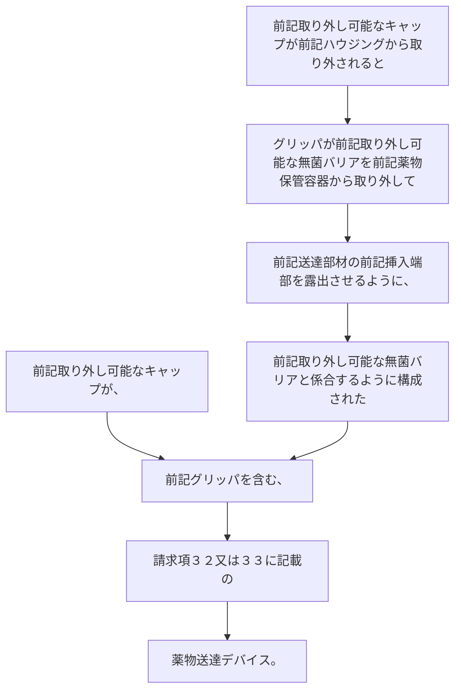

前記取り外し可能なキャップが、前記取り外し可能なキャップが前記ハウジングから取り外されるとグリッパが前記取り外し可能な無菌バリアを前記薬物保管容器から取り外して前記送達部材の前記挿入端部を露出させるように、前記取り外し可能な無菌バリアと係合するように構成された前記グリッパを含む、請求項３２又は３３に記載の薬物送達デバイス。

```mermaid
flowchart TD
A[前記取り外し可能なキャップが、]
B[前記取り外し可能なキャップが前記ハウジングから取り外されると]
C[グリッパが前記取り外し可能な無菌バリアを前記薬物保管容器から取り外して]
D[前記送達部材の前記挿入端部を露出させるように、]
E[前記取り外し可能な無菌バリアと係合するように構成された]
F[前記グリッパを含む、]
G[請求項３２又は３３に記載の]
H[薬物送達デバイス。]

A --> F
B --> C
C --> D
D --> E
E --> F
F --> G
G --> H
```