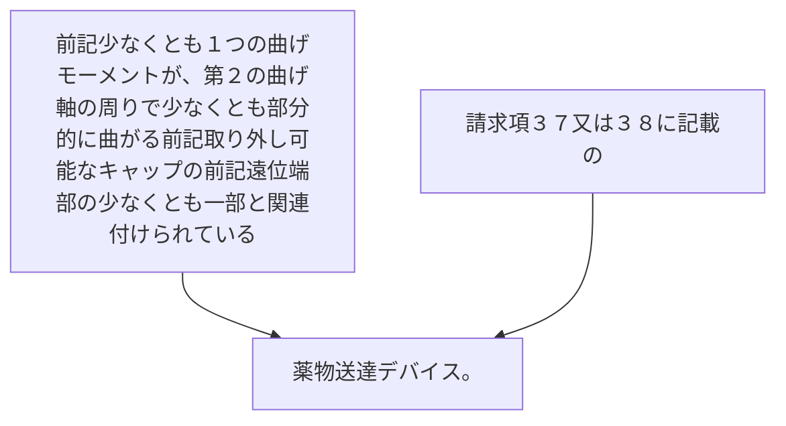

前記少なくとも１つの曲げモーメントが、第２の曲げ軸の周りで少なくとも部分的に曲がる前記取り外し可能なキャップの前記遠位端部の少なくとも一部と関連付けられている、請求項３７又は３８に記載の薬物送達デバイス。

```mermaid
flowchart TD
A[前記少なくとも１つの曲げモーメントが、第２の曲げ軸の周りで少なくとも部分的に曲がる前記取り外し可能なキャップの前記遠位端部の少なくとも一部と関連付けられている]
B[請求項３７又は３８に記載の]
C[薬物送達デバイス。]
A --> C
B --> C
```