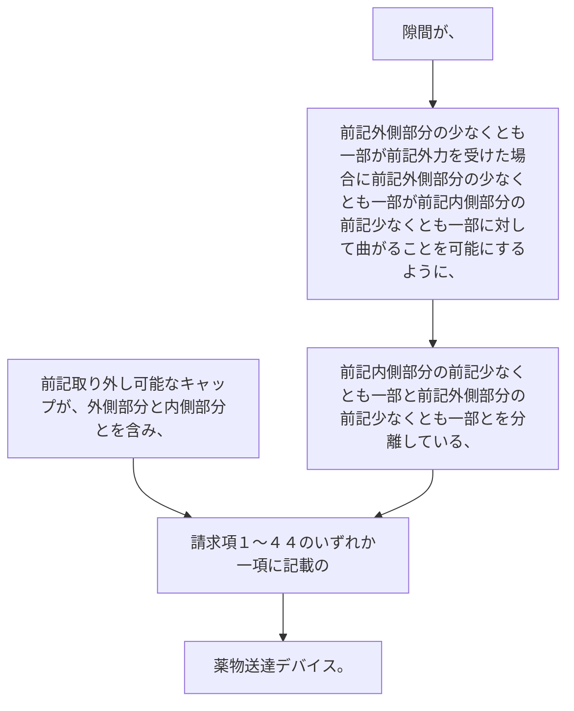

```mermaid
flowchart TD
A[前記取り外し可能なキャップが、外側部分と内側部分とを含み、]
B[隙間が、]
C[前記外側部分の少なくとも一部が前記外力を受けた場合に前記外側部分の少なくとも一部が前記内側部分の前記少なくとも一部に対して曲がることを可能にするように、]
D[前記内側部分の前記少なくとも一部と前記外側部分の前記少なくとも一部とを分離している、]
E[請求項１～４４のいずれか一項に記載の]
F[薬物送達デバイス。]
B --> C
C --> D
A --> E
D --> E
E --> F
```