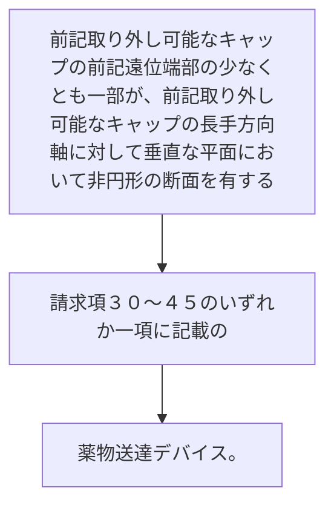

前記取り外し可能なキャップの前記遠位端部の少なくとも一部が、前記取り外し可能なキャップの長手方向軸に対して垂直な平面において非円形の断面を有する、請求項３０～４５のいずれか一項に記載の薬物送達デバイス。

```mermaid
flowchart TD
A[前記取り外し可能なキャップの前記遠位端部の少なくとも一部が、前記取り外し可能なキャップの長手方向軸に対して垂直な平面において非円形の断面を有する]
B[請求項３０～４５のいずれか一項に記載の]
C[薬物送達デバイス。]
A --> B
B --> C
```