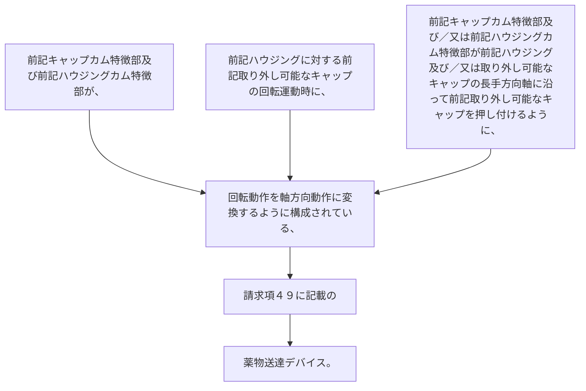

```mermaid
flowchart TD
A[前記キャップカム特徴部及び前記ハウジングカム特徴部が、]
B[前記ハウジングに対する前記取り外し可能なキャップの回転運動時に、]
C[前記キャップカム特徴部及び／又は前記ハウジングカム特徴部が前記ハウジング及び／又は取り外し可能なキャップの長手方向軸に沿って前記取り外し可能なキャップを押し付けるように、]
D[回転動作を軸方向動作に変換するように構成されている、]
E[請求項４９に記載の]
F[薬物送達デバイス。]
A --> D
B --> D
C --> D
D --> E
E --> F
```