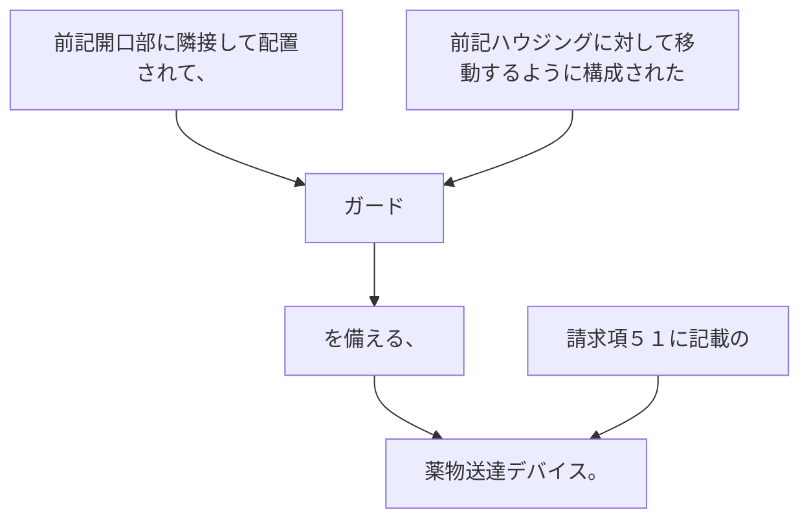

前記開口部に隣接して配置されて、前記ハウジングに対して移動するように構成されたガードを備える、請求項５１に記載の薬物送達デバイス。

```mermaid
flowchart TD
A[前記開口部に隣接して配置されて、]
B[前記ハウジングに対して移動するように構成された]
C[ガード]
D[を備える、]
E[請求項５１に記載の]
F[薬物送達デバイス。]
A --> C
B --> C
C --> D
D --> F
E --> F
```