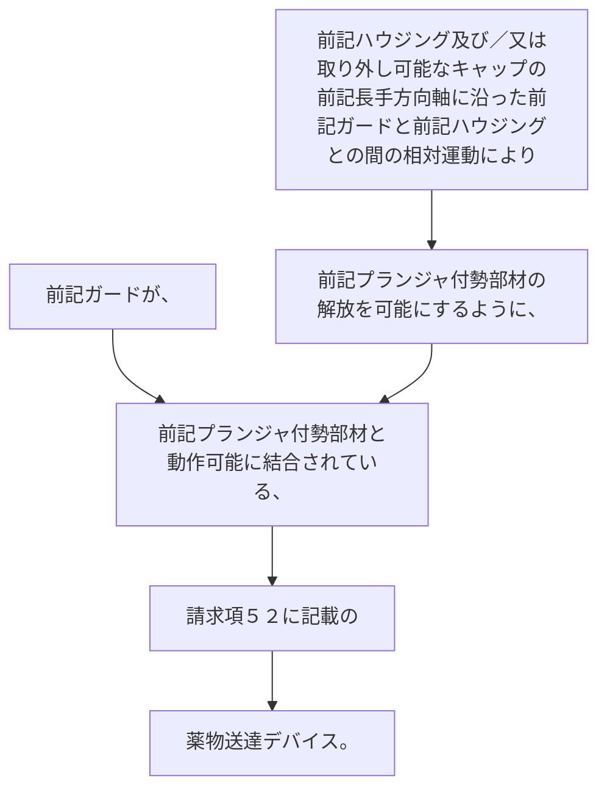

```mermaid
flowchart TD
A[前記ガードが、]
B[前記ハウジング及び／又は取り外し可能なキャップの前記長手方向軸に沿った前記ガードと前記ハウジングとの間の相対運動により]
C[前記プランジャ付勢部材の解放を可能にするように、]
D[前記プランジャ付勢部材と動作可能に結合されている、]
E[請求項５２に記載の]
F[薬物送達デバイス。]
A --> D
B --> C
C --> D
D --> E
E --> F
```