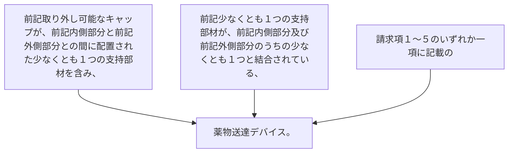

前記取り外し可能なキャップが、前記内側部分と前記外側部分との間に配置された少なくとも１つの支持部材を含み、前記少なくとも１つの支持部材が、前記内側部分及び前記外側部分のうちの少なくとも１つと結合されている、請求項１～５のいずれか一項に記載の薬物送達デバイス。

```mermaid
flowchart TD
A[前記取り外し可能なキャップが、前記内側部分と前記外側部分との間に配置された少なくとも１つの支持部材を含み、]
B[前記少なくとも１つの支持部材が、前記内側部分及び前記外側部分のうちの少なくとも１つと結合されている、]
C[請求項１～５のいずれか一項に記載の]
D[薬物送達デバイス。]
A --> D
B --> D
C --> D
```