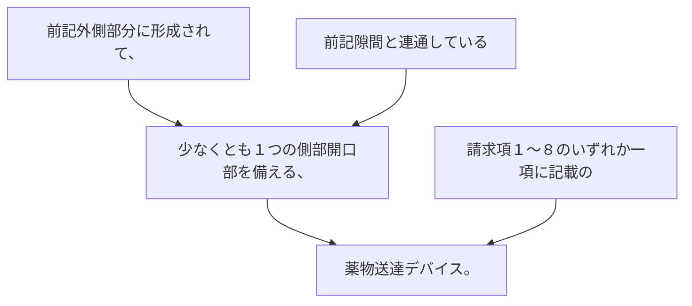

前記外側部分に形成されて、前記隙間と連通している少なくとも１つの側部開口部を備える、請求項１～８のいずれか一項に記載の薬物送達デバイス。

```mermaid
flowchart TD
A[前記外側部分に形成されて、]
B[前記隙間と連通している]
C[少なくとも１つの側部開口部を備える、]
D[請求項１～８のいずれか一項に記載の]
E[薬物送達デバイス。]
A --> C
B --> C
C --> E
D --> E
```