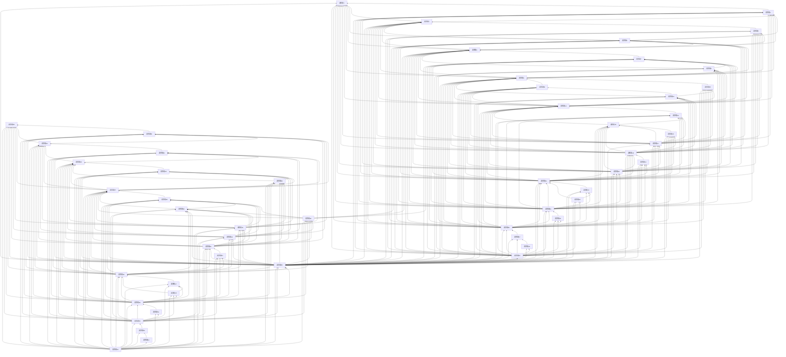

```mermaid
flowchart BT
A[請求項1]
B[請求項2]
C[請求項3]
D[請求項4]
E[請求項5]
F[請求項6]
G[請求項7]
H[請求項8]
I[請求項9]
J[請求項10]
K[請求項11]
L[請求項12]
M[請求項13]
N[請求項14]
O[請求項15]
P[請求項16]
Q[請求項17]
R[請求項18]
S[請求項19]
T[請求項20]
U[請求項21]
V[請求項22]
W[請求項23]
X[請求項24]
Y[請求項25]
Z[請求項26]
ZA[請求項27]
ZB[請求項28]
ZC[請求項29]
ZD[請求項30]
ZE[請求項31]
ZF[請求項32]
ZG[請求項33]
ZH[請求項34]
ZI[請求項35]
ZJ[請求項36]
ZK[請求項37]
ZL[請求項38]
ZM[請求項39]
ZN[請求項40]
ZO[請求項41]
ZP[請求項42]
ZQ[請求項43]
ZR[請求項44]
ZS[請求項45]
ZT[請求項46]
ZU[請求項47]
ZV[請求項48]
ZW[請求項49]
ZX[請求項50]
ZY[請求項51]
ZZ[請求項52]
ZAA[請求項53]
ZAB[請求項54]

B --> A
C --> A
C --> B
D --> C
E --> A
E --> B
E --> C
E --> D
F --> A
F --> B
F --> C
F --> D
F --> E
G --> F
H --> F
H --> G
I --> A
I --> B
I --> C
I --> D
I --> E
I --> F
I --> G
I --> H
J --> I
K --> I
L --> I
L --> J
L --> K
M --> A
M --> B
M --> C
M --> D
M --> E
M --> F
M --> G
M --> H
M --> I
M --> J
M --> K
M --> L
N --> M
O --> M
O --> N
P --> O
Q --> A
Q --> B
Q --> C
Q --> D
Q --> E
Q --> F
Q --> G
Q --> H
Q --> I
Q --> J
Q --> K
Q --> L
Q --> M
Q --> N
Q --> O
Q --> P
R --> A
R --> B
R --> C
R --> D
R --> E
R --> F
R --> G
R --> H
R --> I
R --> J
R --> K
R --> L
R --> M
R --> N
R --> O
R --> P
R --> Q
S --> R
T --> A
T --> B
T --> C
T --> D
T --> E
T --> F
T --> G
T --> H
T --> I
T --> J
T --> K
T --> L
T --> M
T --> N
T --> O
T --> P
T --> Q
T --> R
T --> S
U --> A
U --> B
U --> C
U --> D
U --> E
U --> F
U --> G
U --> H
U --> I
U --> J
U --> K
U --> L
U --> M
U --> N
U --> O
U --> P
U --> Q
U --> R
U --> S
U --> T
V --> U
W --> U
W --> V
X --> A
X --> B
X --> C
X --> D
X --> E
X --> F
X --> G
X --> H
X --> I
X --> J
X --> K
X --> L
X --> M
X --> N
X --> O
X --> P
X --> Q
X --> R
X --> S
X --> T
X --> U
X --> V
X --> W
Y --> X
Z --> A
Z --> B
Z --> C
Z --> D
Z --> E
Z --> F
Z --> G
Z --> H
Z --> I
Z --> J
Z --> K
Z --> L
Z --> M
Z --> N
Z --> O
Z --> P
Z --> Q
Z --> R
Z --> S
Z --> T
Z --> U
Z --> V
Z --> W
Z --> X
Z --> Y
ZA --> Z
ZB --> ZA
ZC --> A
ZC --> B
ZC --> C
ZC --> D
ZC --> E
ZC --> F
ZC --> G
ZC --> H
ZC --> I
ZC --> J
ZC --> K
ZC --> L
ZC --> M
ZC --> N
ZC --> O
ZC --> P
ZC --> Q
ZC --> R
ZC --> S
ZC --> T
ZC --> U
ZC --> V
ZC --> W
ZC --> X
ZC --> Y
ZC --> Z
ZC --> ZA
ZC --> ZB

ZE --> ZD
ZF --> ZD
ZF --> ZE
ZG --> ZF
ZH --> ZF
ZH --> ZG
ZI --> ZH
ZJ --> ZH
ZJ --> ZI
ZK --> ZD
ZK --> ZE
ZK --> ZF
ZK --> ZG
ZK --> ZH
ZK --> ZI
ZK --> ZJ
ZL --> ZK
ZM --> ZK
ZM --> ZL
ZN --> E
ZN --> F
ZN --> G
ZN --> ZK
ZN --> ZL
ZN --> ZM
ZO --> ZD
ZO --> ZE
ZO --> ZF
ZO --> ZG
ZO --> ZH
ZO --> ZI
ZO --> ZJ
ZO --> ZK
ZO --> ZL
ZO --> ZM
ZO --> ZN
ZP --> ZD
ZP --> ZE
ZP --> ZF
ZP --> ZG
ZP --> ZH
ZP --> ZI
ZP --> ZJ
ZP --> ZK
ZP --> ZL
ZP --> ZM
ZP --> ZN
ZP --> ZO
ZQ --> ZD
ZQ --> ZE
ZQ --> ZF
ZQ --> ZG
ZQ --> ZH
ZQ --> ZI
ZQ --> ZJ
ZQ --> ZK
ZQ --> ZL
ZQ --> ZM
ZQ --> ZN
ZQ --> ZO
ZQ --> ZP
ZR --> ZQ
ZS --> A
ZS --> B
ZS --> C
ZS --> D
ZS --> E
ZS --> F
ZS --> G
ZS --> H
ZS --> I
ZS --> J
ZS --> K
ZS --> L
ZS --> M
ZS --> N
ZS --> O
ZS --> P
ZS --> Q
ZS --> R
ZS --> S
ZS --> T
ZS --> U
ZS --> V
ZS --> W
ZS --> X
ZS --> Y
ZS --> Z
ZS --> ZA
ZS --> ZB
ZS --> ZC
ZS --> ZD
ZS --> ZE
ZS --> ZF
ZS --> ZG
ZS --> ZH
ZS --> ZI
ZS --> ZJ
ZS --> ZK
ZS --> ZL
ZS --> ZM
ZS --> ZN
ZS --> ZO
ZS --> ZP
ZS --> ZQ
ZS --> ZR
ZT --> ZD
ZT --> ZE
ZT --> ZF
ZT --> ZG
ZT --> ZH
ZT --> ZI
ZT --> ZJ
ZT --> ZK
ZT --> ZL
ZT --> ZM
ZT --> ZN
ZT --> ZO
ZT --> ZP
ZT --> ZQ
ZT --> ZR
ZT --> ZS
ZU --> ZT
ZV --> ZT
ZV --> ZU
ZW --> ZD
ZW --> ZE
ZW --> ZF
ZW --> ZG
ZW --> ZH
ZW --> ZI
ZW --> ZJ
ZW --> ZK
ZW --> ZL
ZW --> ZM
ZW --> ZN
ZW --> ZO
ZW --> ZP
ZW --> ZQ
ZW --> ZR
ZW --> ZS
ZW --> ZT
ZW --> ZU
ZW --> ZV
ZX --> ZW
ZY --> ZD
ZY --> ZE
ZY --> ZF
ZY --> ZG
ZY --> ZH
ZY --> ZI
ZY --> ZJ
ZY --> ZK
ZY --> ZL
ZY --> ZM
ZY --> ZN
ZY --> ZO
ZY --> ZP
ZY --> ZQ
ZY --> ZR
ZY --> ZS
ZY --> ZT
ZY --> ZU
ZY --> ZV
ZY --> ZW
ZY --> ZX
ZZ --> ZY
ZAA --> ZZ
ZAB --> ZD
ZAB --> ZE
ZAB --> ZF
ZAB --> ZG
ZAB --> ZH
ZAB --> ZI
ZAB --> ZJ
ZAB --> ZK
ZAB --> ZL
ZAB --> ZM
ZAB --> ZN
ZAB --> ZO
ZAB --> ZP
ZAB --> ZQ
ZAB --> ZR
ZAB --> ZS
ZAB --> ZT
ZAB --> ZU
ZAB --> ZV
ZAB --> ZW
ZAB --> ZX
ZAB --> ZY
ZAB --> ZZ
ZAB --> ZAA
```
