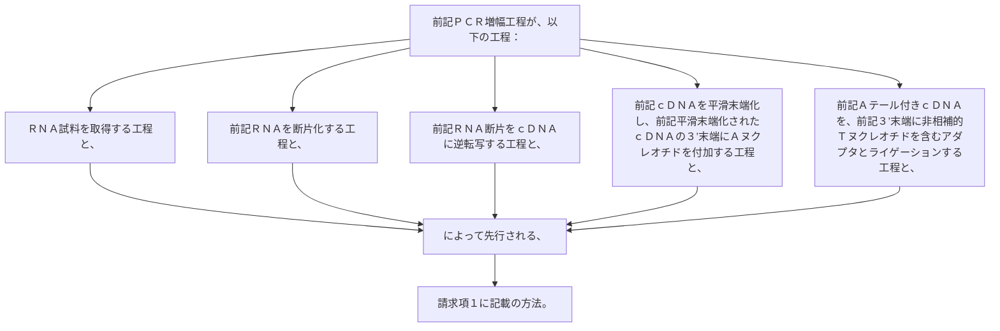

前記ＰＣＲ増幅工程が、以下の工程：
ＲＮＡ試料を取得する工程と、
前記ＲＮＡを断片化する工程と、
前記ＲＮＡ断片をｃＤＮＡに逆転写する工程と、
前記ｃＤＮＡを平滑末端化し、前記平滑末端化されたｃＤＮＡの３’末端にＡヌクレオチドを付加する工程と、
前記Ａテール付きｃＤＮＡを、前記３’末端に非相補的Ｔヌクレオチドを含むアダプタとライゲーションする工程と、によって先行される、請求項１に記載の方法。
