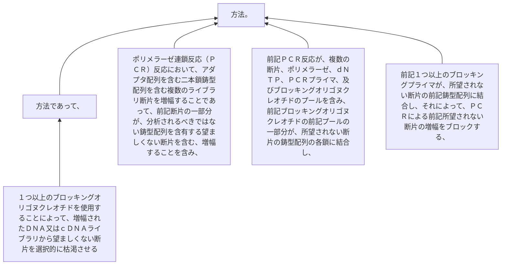

１つ以上のブロッキングオリゴヌクレオチドを使用することによって、増幅されたＤＮＡ又はｃＤＮＡライブラリから望ましくない断片を選択的に枯渇させる方法であって、
ポリメラーゼ連鎖反応（ＰＣＲ）反応において、アダプタ配列を含む二本鎖鋳型配列を含む複数のライブラリ断片を増幅することであって、前記断片の一部分が、分析されるべきではない鋳型配列を含有する望ましくない断片を含む、増幅することを含み、
前記ＰＣＲ反応が、複数の断片、ポリメラーゼ、ｄＮＴＰ、ＰＣＲプライマ、及びブロッキングオリゴヌクレオチドのプールを含み、前記ブロッキングオリゴヌクレオチドの前記プールの一部分が、所望されない断片の鋳型配列の各鎖に結合し、
前記１つ以上のブロッキングプライマが、所望されない断片の前記鋳型配列に結合し、それによって、ＰＣＲによる前記所望されない断片の増幅をブロックする、方法。
