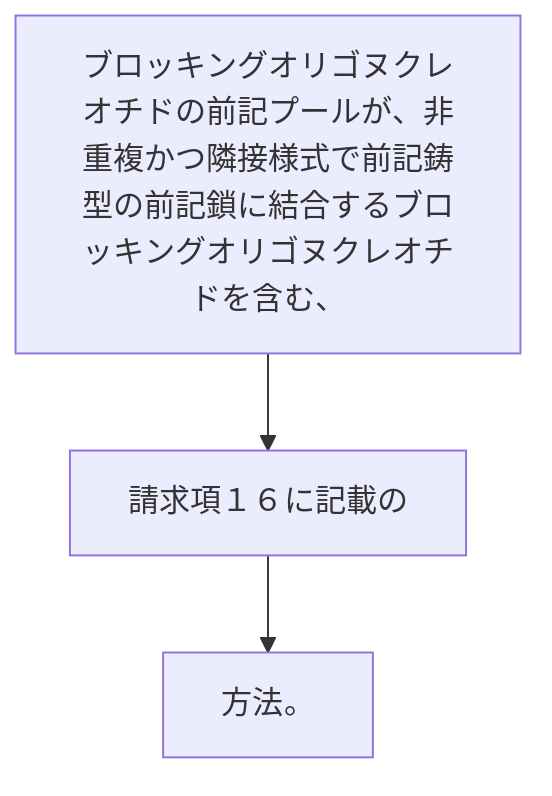

ブロッキングオリゴヌクレオチドの前記プールが、非重複かつ隣接様式で前記鋳型の前記鎖に結合するブロッキングオリゴヌクレオチドを含む、請求項１６に記載の方法。

```mermaid
flowchart TD
A[ブロッキングオリゴヌクレオチドの前記プールが、非重複かつ隣接様式で前記鋳型の前記鎖に結合するブロッキングオリゴヌクレオチドを含む、]
B[請求項１６に記載の]
C[方法。]
A --> B
B --> C
```