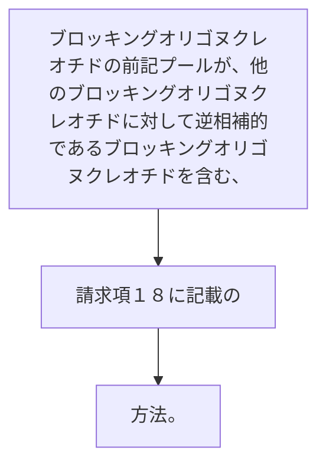

ブロッキングオリゴヌクレオチドの前記プールが、他のブロッキングオリゴヌクレオチドに対して逆相補的であるブロッキングオリゴヌクレオチドを含む、請求項１８に記載の方法。

```mermaid
flowchart TD
A[ブロッキングオリゴヌクレオチドの前記プールが、他のブロッキングオリゴヌクレオチドに対して逆相補的であるブロッキングオリゴヌクレオチドを含む、]
B[請求項１８に記載の]
C[方法。]
A --> B
B --> C
```