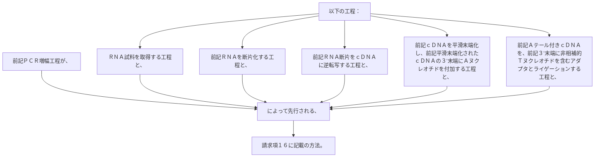

```mermaid
flowchart TD
A[前記ＰＣＲ増幅工程が、]
B[以下の工程：]
C[ＲＮＡ試料を取得する工程と、]
D[前記ＲＮＡを断片化する工程と、]
E[前記ＲＮＡ断片をｃＤＮＡに逆転写する工程と、]
F[前記ｃＤＮＡを平滑末端化し、前記平滑末端化されたｃＤＮＡの３’末端にＡヌクレオチドを付加する工程と、]
G[前記Ａテール付きｃＤＮＡを、前記３’末端に非相補的Ｔヌクレオチドを含むアダプタとライゲーションする工程と、]
H[によって先行される、]
I[請求項１６に記載の方法。]

A --> H
B --> C
B --> D
B --> E
B --> F
B --> G
C --> H
D --> H
E --> H
F --> H
G --> H
H --> I
```