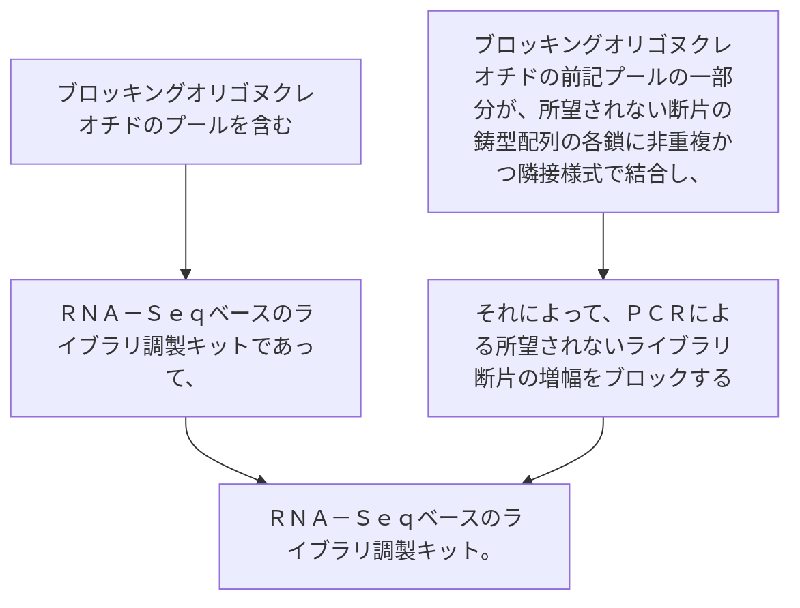

ブロッキングオリゴヌクレオチドのプールを含むＲＮＡ－Ｓｅｑベースのライブラリ調製キットであって、ブロッキングオリゴヌクレオチドの前記プールの一部分が、所望されない断片の鋳型配列の各鎖に非重複かつ隣接様式で結合し、それによって、ＰＣＲによる所望されないライブラリ断片の増幅をブロックする、ＲＮＡ－Ｓｅｑベースのライブラリ調製キット。

```mermaid
flowchart TD
A[ブロッキングオリゴヌクレオチドのプールを含む]
B[ＲＮＡ－Ｓｅｑベースのライブラリ調製キットであって、]
C[ブロッキングオリゴヌクレオチドの前記プールの一部分が、所望されない断片の鋳型配列の各鎖に非重複かつ隣接様式で結合し、]
D[それによって、ＰＣＲによる所望されないライブラリ断片の増幅をブロックする]
E[ＲＮＡ－Ｓｅｑベースのライブラリ調製キット。]
A --> B
B --> E
C --> D
D --> E
```