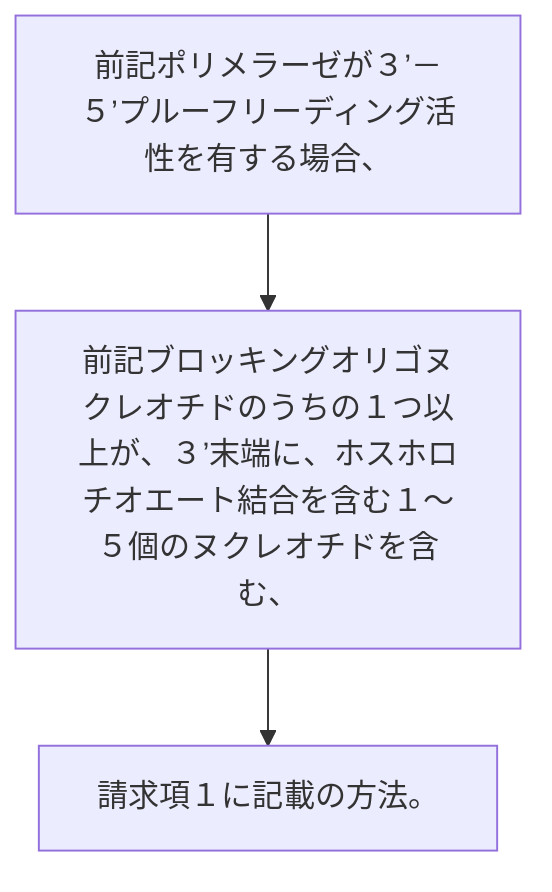

前記ポリメラーゼが３’－５’プルーフリーディング活性を有する場合、前記ブロッキングオリゴヌクレオチドのうちの１つ以上が、３’末端に、ホスホロチオエート結合を含む１～５個のヌクレオチドを含む、請求項１に記載の方法。

```mermaid
flowchart TD
A[前記ポリメラーゼが３’－５’プルーフリーディング活性を有する場合、]
B[前記ブロッキングオリゴヌクレオチドのうちの１つ以上が、３’末端に、ホスホロチオエート結合を含む１～５個のヌクレオチドを含む、]
C[請求項１に記載の方法。]
A --> B
B --> C
```