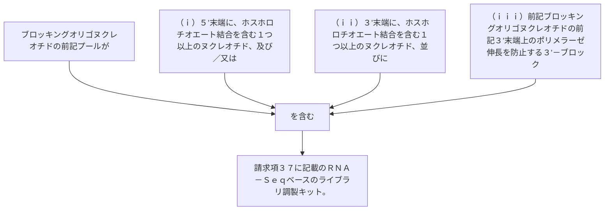

ブロッキングオリゴヌクレオチドの前記プールが、（ｉ）、及び／又は（ｉｉ）、並びに（ｉｉｉ）：
（ｉ）５’末端に、ホスホロチオエート結合を含む１つ以上のヌクレオチド、及び／又は
（ｉｉ）３’末端に、ホスホロチオエート結合を含む１つ以上のヌクレオチド、並びに
（ｉｉｉ）前記ブロッキングオリゴヌクレオチドの前記３’末端上のポリメラーゼ伸長を防止する３’－ブロック、を含む、請求項３７に記載のＲＮＡ－Ｓｅｑベースのライブラリ調製キット。
