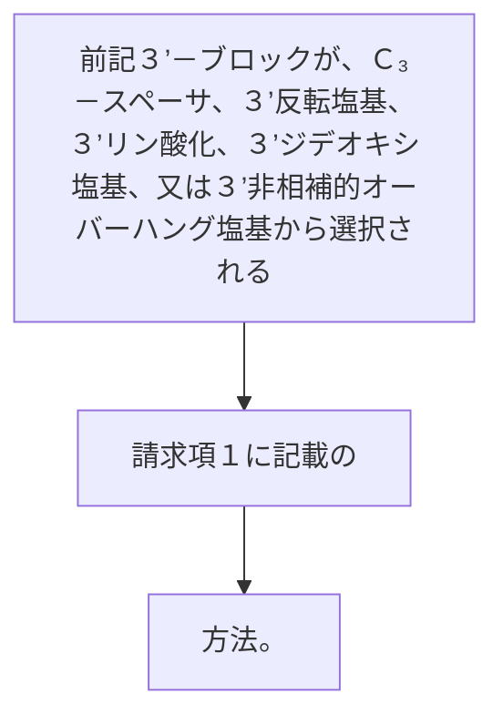

前記３’－ブロックが、Ｃ
３
－スペーサ、３’反転塩基、３’リン酸化、３’ジデオキシ塩基、又は３’非相補的オーバーハング塩基から選択される、請求項１に記載の方法。

```mermaid
flowchart TD
A[前記３’－ブロックが、Ｃ₃－スペーサ、３’反転塩基、３’リン酸化、３’ジデオキシ塩基、又は３’非相補的オーバーハング塩基から選択される]
B[請求項１に記載の]
C[方法。]
A --> B
B --> C
```