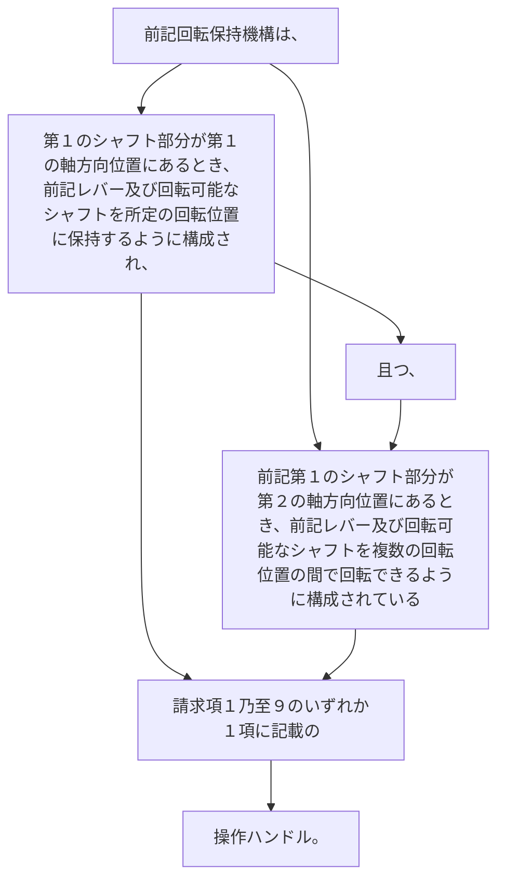

```mermaid
flowchart TD
A[前記回転保持機構は、]
B[第１のシャフト部分が第１の軸方向位置にあるとき、前記レバー及び回転可能なシャフトを所定の回転位置に保持するように構成され、]
C[且つ、]
D[前記第１のシャフト部分が第２の軸方向位置にあるとき、前記レバー及び回転可能なシャフトを複数の回転位置の間で回転できるように構成されている]
E[請求項１乃至９のいずれか１項に記載の]
F[操作ハンドル。]
A --> B
A --> D
B --> C
C --> D
B --> E
D --> E
E --> F
```