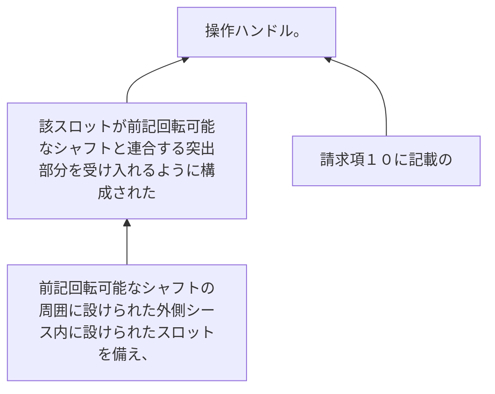

前記回転可能なシャフトの周囲に設けられた外側シース内に設けられたスロットを備え、該スロットが前記回転可能なシャフトと連合する突出部分を受け入れるように構成された請求項１０に記載の操作ハンドル。

```mermaid
flowchart BT
D[操作ハンドル。]
B[該スロットが前記回転可能なシャフトと連合する突出部分を受け入れるように構成された]
C[請求項１０に記載の]
A[前記回転可能なシャフトの周囲に設けられた外側シース内に設けられたスロットを備え、]
A --> B
B --> D
C --> D
```