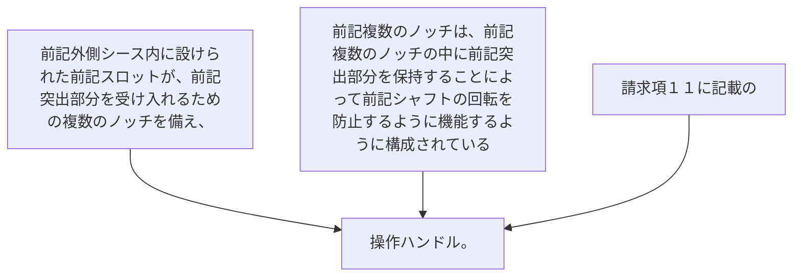

```mermaid
flowchart TD
A[前記外側シース内に設けられた前記スロットが、前記突出部分を受け入れるための複数のノッチを備え、]
B[前記複数のノッチは、前記複数のノッチの中に前記突出部分を保持することによって前記シャフトの回転を防止するように機能するように構成されている]
C[請求項１１に記載の]
D[操作ハンドル。]
A --> D
B --> D
C --> D
```