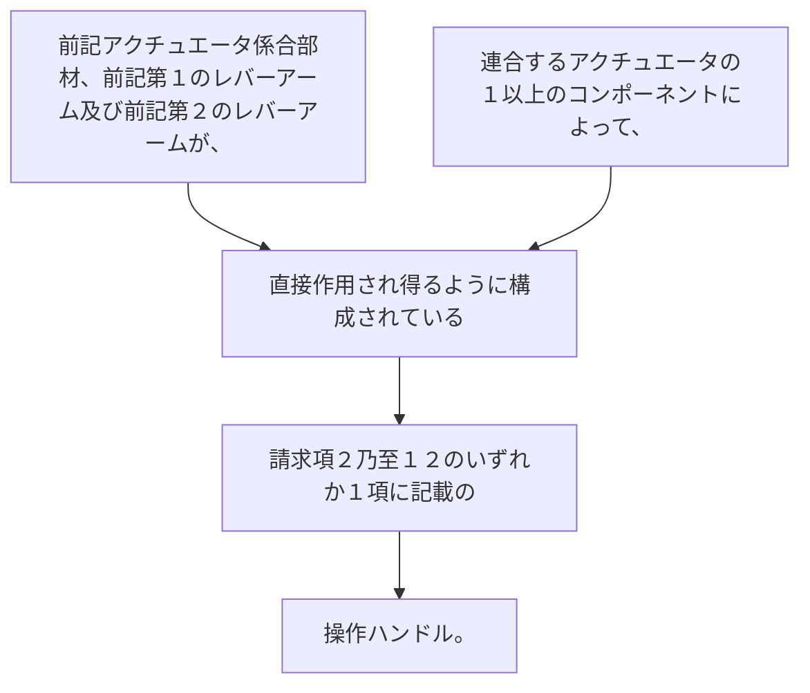

前記アクチュエータ係合部材、前記第１のレバーアーム及び前記第２のレバーアームが、連合するアクチュエータの１以上のコンポーネントによって、直接作用され得るように構成されている請求項２乃至１２のいずれか１項に記載の操作ハンドル。

```mermaid
flowchart TD
A[前記アクチュエータ係合部材、前記第１のレバーアーム及び前記第２のレバーアームが、]
B[連合するアクチュエータの１以上のコンポーネントによって、]
C[直接作用され得るように構成されている]
D[請求項２乃至１２のいずれか１項に記載の]
E[操作ハンドル。]
A --> C
B --> C
C --> D
D --> E
```