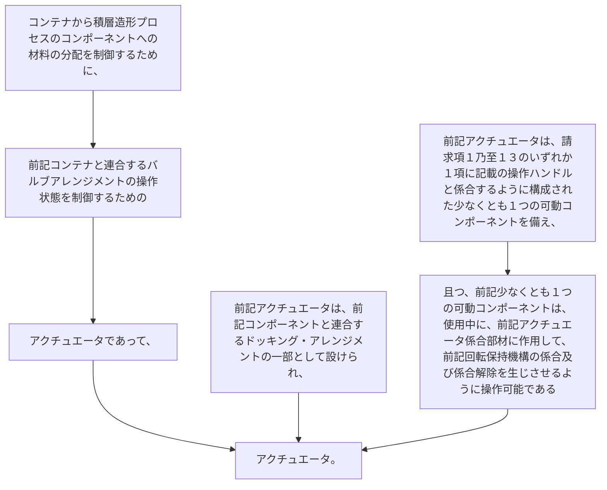

```mermaid
flowchart TD
A[コンテナから積層造形プロセスのコンポーネントへの材料の分配を制御するために、]
B[前記コンテナと連合するバルブアレンジメントの操作状態を制御するための]
C[アクチュエータであって、]
D[前記アクチュエータは、前記コンポーネントと連合するドッキング・アレンジメントの一部として設けられ、]
E[前記アクチュエータは、請求項１乃至１３のいずれか１項に記載の操作ハンドルと係合するように構成された少なくとも１つの可動コンポーネントを備え、]
F[且つ、前記少なくとも１つの可動コンポーネントは、使用中に、前記アクチュエータ係合部材に作用して、前記回転保持機構の係合及び係合解除を生じさせるように操作可能である]
G[アクチュエータ。]

A --> B
B --> C
C --> G
D --> G
E --> F
F --> G
```