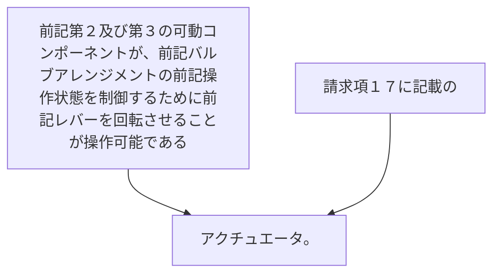

前記第２及び第３の可動コンポーネントが、前記バルブアレンジメントの前記操作状態を制御するために前記レバーを回転させることが操作可能である請求項１７に記載のアクチュエータ。

```mermaid
flowchart TD
A[前記第２及び第３の可動コンポーネントが、前記バルブアレンジメントの前記操作状態を制御するために前記レバーを回転させることが操作可能である]
B[請求項１７に記載の]
C[アクチュエータ。]
A --> C
B --> C
```