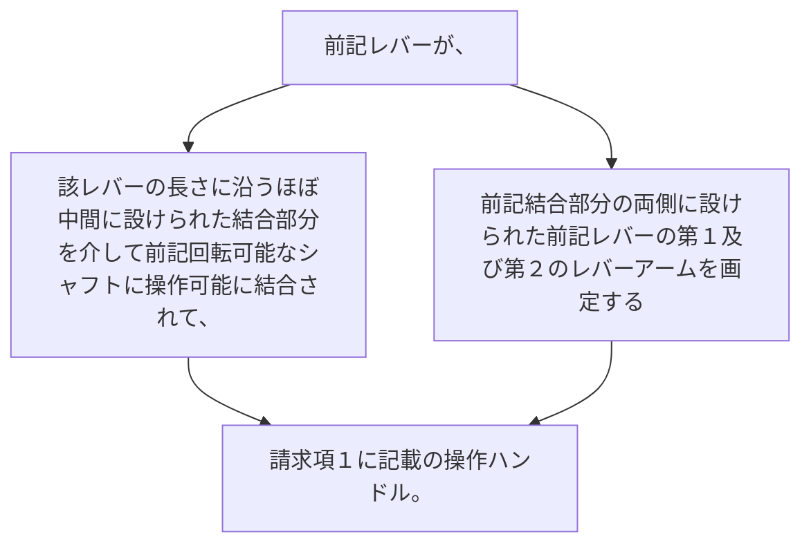

前記レバーが、該レバーの長さに沿うほぼ中間に設けられた結合部分を介して前記回転可能なシャフトに操作可能に結合されて、前記結合部分の両側に設けられた前記レバーの第１及び第２のレバーアームを画定する請求項１に記載の操作ハンドル。

```mermaid
flowchart TD
A[前記レバーが、]
B[該レバーの長さに沿うほぼ中間に設けられた結合部分を介して前記回転可能なシャフトに操作可能に結合されて、]
C[前記結合部分の両側に設けられた前記レバーの第１及び第２のレバーアームを画定する]
D[請求項１に記載の操作ハンドル。]
A --> B
A --> C
B --> D
C --> D
```