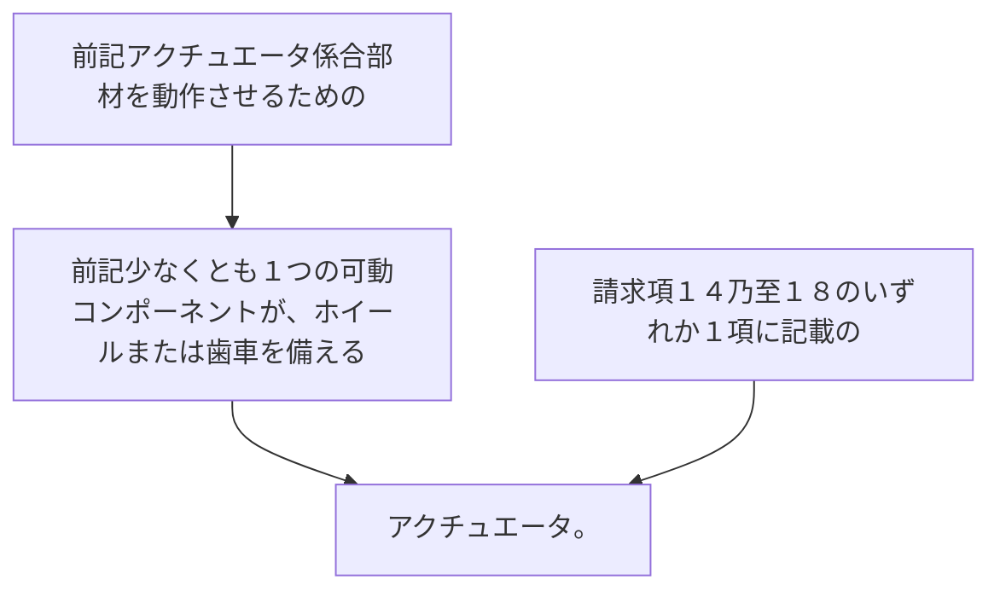

前記アクチュエータ係合部材を動作させるための前記少なくとも１つの可動コンポーネントが、ホイールまたは歯車を備える請求項１４乃至１８のいずれか１項に記載のアクチュエータ。

```mermaid
flowchart TD
A[前記アクチュエータ係合部材を動作させるための]
B[前記少なくとも１つの可動コンポーネントが、ホイールまたは歯車を備える]
C[請求項１４乃至１８のいずれか１項に記載の]
D[アクチュエータ。]
A --> B
B --> D
C --> D
```