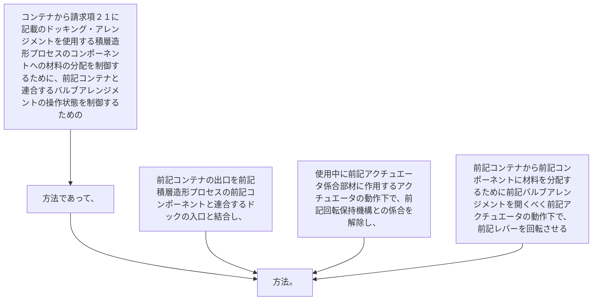

コンテナから請求項２１に記載のドッキング・アレンジメントを使用する積層造形プロセスのコンポーネントへの材料の分配を制御するために、前記コンテナと連合するバルブアレンジメントの操作状態を制御するための方法であって、
前記コンテナの出口を前記積層造形プロセスの前記コンポーネントと連合するドックの入口と結合し、
使用中に前記アクチュエータ係合部材に作用するアクチュエータの動作下で、前記回転保持機構との係合を解除し、
前記コンテナから前記コンポーネントに材料を分配するために前記バルブアレンジメントを開くべく前記アクチュエータの動作下で、前記レバーを回転させる方法。
