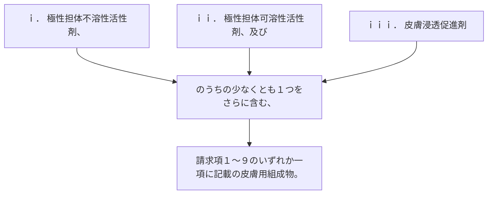

ｉ．  極性担体不溶性活性剤、
ｉｉ．  極性担体可溶性活性剤、及び
ｉｉｉ．  皮膚浸透促進剤
のうちの少なくとも１つをさらに含む、請求項１～９のいずれか一項に記載の皮膚用組成物。

```mermaid
flowchart TD
A[ｉ． 極性担体不溶性活性剤、]
B[ｉｉ． 極性担体可溶性活性剤、及び]
C[ｉｉｉ． 皮膚浸透促進剤]
D[のうちの少なくとも１つをさらに含む、]
E[請求項１～９のいずれか一項に記載の皮膚用組成物。]
A --> D
B --> D
C --> D
D --> E
```