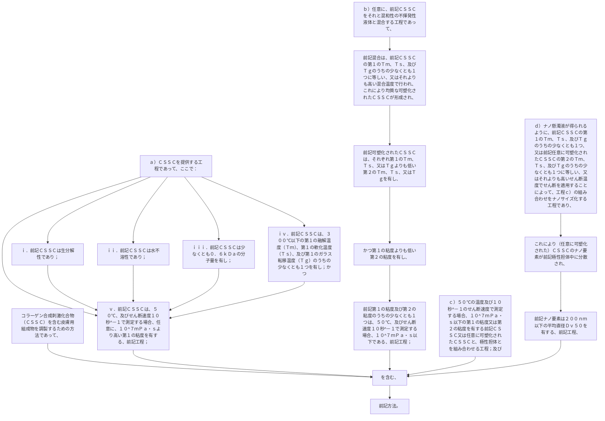

```mermaid
flowchart TD
A[コラーゲン合成刺激化合物（ＣＳＳＣ）を含む皮膚用組成物を調製するための方法であって、]
B[前記方法。]
Q[を含む、]

C1[ａ）ＣＳＳＣを提供する工程であって、ここで：]
C2[ｉ．前記ＣＳＳＣは生分解性であり；]
C3[ｉｉ．前記ＣＳＳＣは水不溶性であり；]
C4[ｉｉｉ．前記ＣＳＳＣは少なくとも０．６ｋＤａの分子量を有し；]
C5[ｉｖ．前記ＣＳＳＣは、３００℃以下の第１の融解温度（Ｔｍ）、第１の軟化温度（Ｔｓ）、及び第１のガラス転移温度（Ｔｇ）のうちの少なくとも１つを有し；かつ]
C6[ｖ．前記ＣＳＳＣは、５０℃、及びせん断速度１０秒^－１で測定する場合、任意に、１０^７ｍＰａ・ｓより高い第１の粘度を有する、前記工程；]

D1[ｂ）任意に、前記ＣＳＳＣをそれと混和性の不揮発性液体と混合する工程であって、]
D2[前記混合は、前記ＣＳＳＣの第１のＴｍ、Ｔｓ、及びＴｇのうちの少なくとも１つに等しい、又はそれよりも高い混合温度で行われ、これにより均質な可塑化されたＣＳＳＣが形成され、]
D3[前記可塑化されたＣＳＳＣは、それぞれ第１のＴｍ、Ｔｓ、又はＴｇよりも低い第２のＴｍ、Ｔｓ、又はＴｇを有し、]
D4[かつ第１の粘度よりも低い第２の粘度を有し、]
D5[前記第１の粘度及び第２の粘度のうちの少なくとも１つは、５０℃、及びせん断速度１０秒^－１で測定する場合、１０^７ｍＰａ・ｓ以下である、前記工程；]

E1[ｃ）５０℃の温度及び１０秒^－１のせん断速度で測定する場合、１０^７ｍＰａ・ｓ以下の第１の粘度又は第２の粘度を有する前記ＣＳＳＣ又は任意に可塑化されたＣＳＳＣと、極性担体とを組み合わせる工程；及び]

F1[ｄ）ナノ懸濁液が得られるように、前記ＣＳＳＣの第１のＴｍ、Ｔｓ、及びＴｇのうちの少なくとも１つ、又は前記任意に可塑化されたＣＳＳＣの第２のＴｍ、Ｔｓ、及びＴｇのうちの少なくとも１つに等しい、又はそれよりも高いせん断温度でせん断を適用することによって、工程ｃ）の組み合わせをナノサイズ化する工程であり、]
F2[これにより（任意に可塑化された）ＣＳＳＣのナノ要素が前記極性担体中に分散され、]
F3[前記ナノ要素は２００ｎｍ以下の平均直径Ｄｖ５０を有する、前記工程、]

A --> Q
Q --> B

C1 --> C2
C1 --> C3
C1 --> C4
C1 --> C5
C1 --> C6
C2 --> C6
C3 --> C6
C4 --> C6
C5 --> C6
C6 --> Q

D1 --> D2
D2 --> D3
D3 --> D4
D4 --> D5
D5 --> Q

E1 --> Q

F1 --> F2
F2 --> F3
F3 --> Q
```