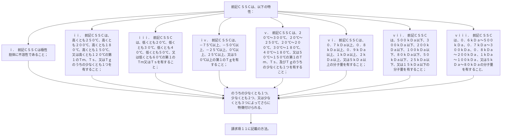

前記ＣＳＳＣは、以下の特性：
ｉ．  前記ＣＳＳＣは極性担体に不溶性であること；
ｉｉ．  前記ＣＳＳＣは、高くとも２５０℃、高くとも２００℃、高くとも１８０℃、高くとも１５０℃、又は高くとも１２０℃の第１のＴｍ、Ｔｓ、又はＴｇのうちの少なくとも１つを有すること；
ｉｉｉ．  前記ＣＳＳＣは、低くとも２０℃、低くとも３０℃、低くとも４０℃、低くとも５０℃、又は低くとも６０℃の第１のＴｍ又はＴｓを有すること；
ｉｖ．  前記ＣＳＳＣは、－７５℃以上、－５０℃以上、－２５℃以上、０℃以上、２５℃以上、又は５０℃以上の第１のＴｇを有すること；
ｖ．  前記ＣＳＳＣは、２０℃～３００℃、２０℃～２５０℃、２０℃～２００℃、３０℃～１８０℃、４０℃～１８０℃、又は５０℃～１５０℃の第１のＴｍ、Ｔｓ、及びＴｇのうちの少なくとも１つを有すること；
ｖｉ．  前記ＣＳＳＣは、０．７ｋＤａ以上、０．８ｋＤａ以上、０．９ｋＤａ以上、１ｋＤａ以上、２ｋＤａ以上、又は５ｋＤａ以上の分子量を有すること；
ｖｉｉ．  前記ＣＳＳＣは、５００ｋＤａ以下、３００ｋＤａ以下、２００ｋＤａ以下、１００ｋＤａ以下、８０ｋＤａ以下、５０ｋＤａ以下、２５ｋＤａ以下、又は１５ｋＤａ以下の分子量を有すること；及び
ｖｉｉｉ．  前記ＣＳＳＣは、０．６ｋＤａ～５００ｋＤａ、０．７ｋＤａ～３００ｋＤａ、０．８ｋＤａ～２００ｋＤａ、１ｋＤａ～１００ｋＤａ、又は５ｋＤａ～８０ｋＤａの分子量を有すること、
のうちの少なくとも１つ、少なくとも２つ、又は少なくとも３つによってさらに特徴付けられる、請求項１１に記載の方法。
