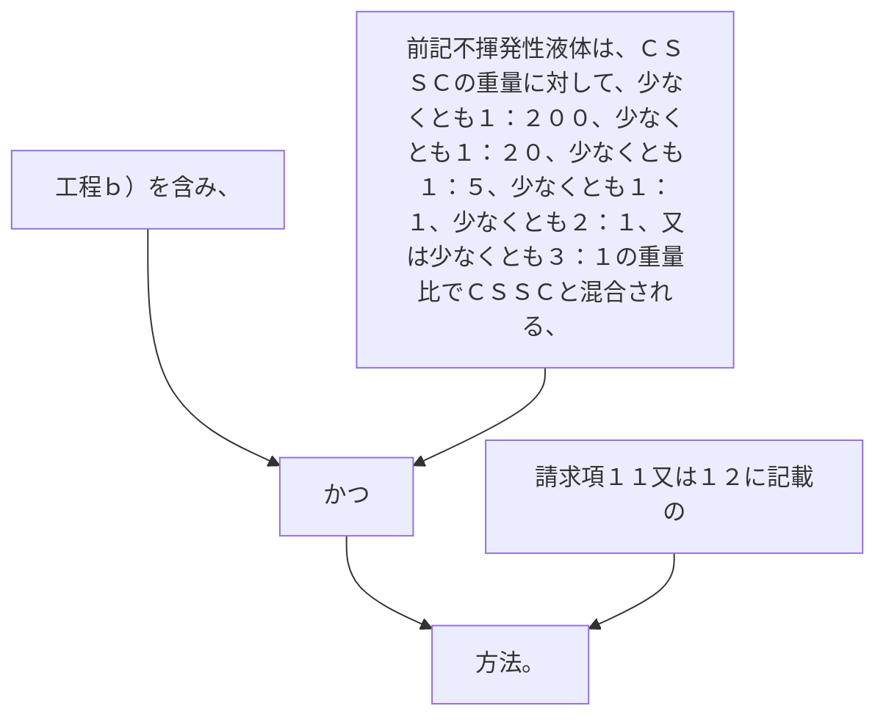

```mermaid
flowchart TD
A[工程ｂ）を含み、]
B["かつ"]
C[前記不揮発性液体は、ＣＳＳＣの重量に対して、少なくとも１：２００、少なくとも１：２０、少なくとも１：５、少なくとも１：１、少なくとも２：１、又は少なくとも３：１の重量比でＣＳＳＣと混合される、]
D[請求項１１又は１２に記載の]
E[方法。]

A --> B
C --> B
B --> E
D --> E
```