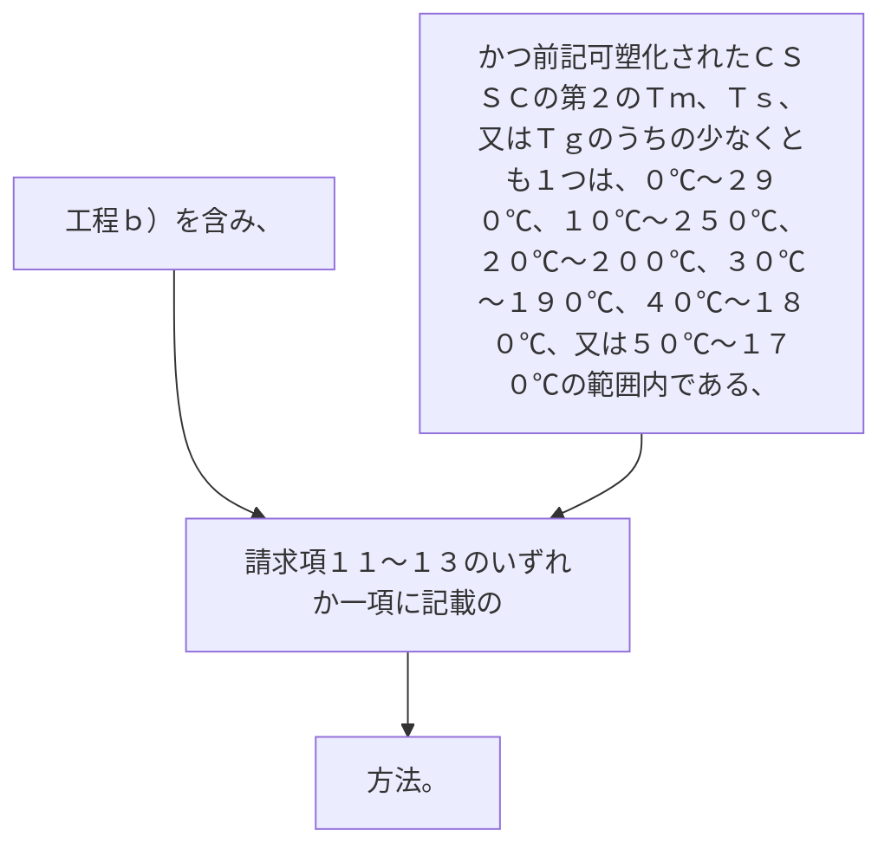

```mermaid
flowchart TD
A[工程ｂ）を含み、]
B[かつ前記可塑化されたＣＳＳＣの第２のＴｍ、Ｔｓ、又はＴｇのうちの少なくとも１つは、０℃～２９０℃、１０℃～２５０℃、２０℃～２００℃、３０℃～１９０℃、４０℃～１８０℃、又は５０℃～１７０℃の範囲内である、]
C[請求項１１～１３のいずれか一項に記載の]
D[方法。]
A --> C
B --> C
C --> D
```