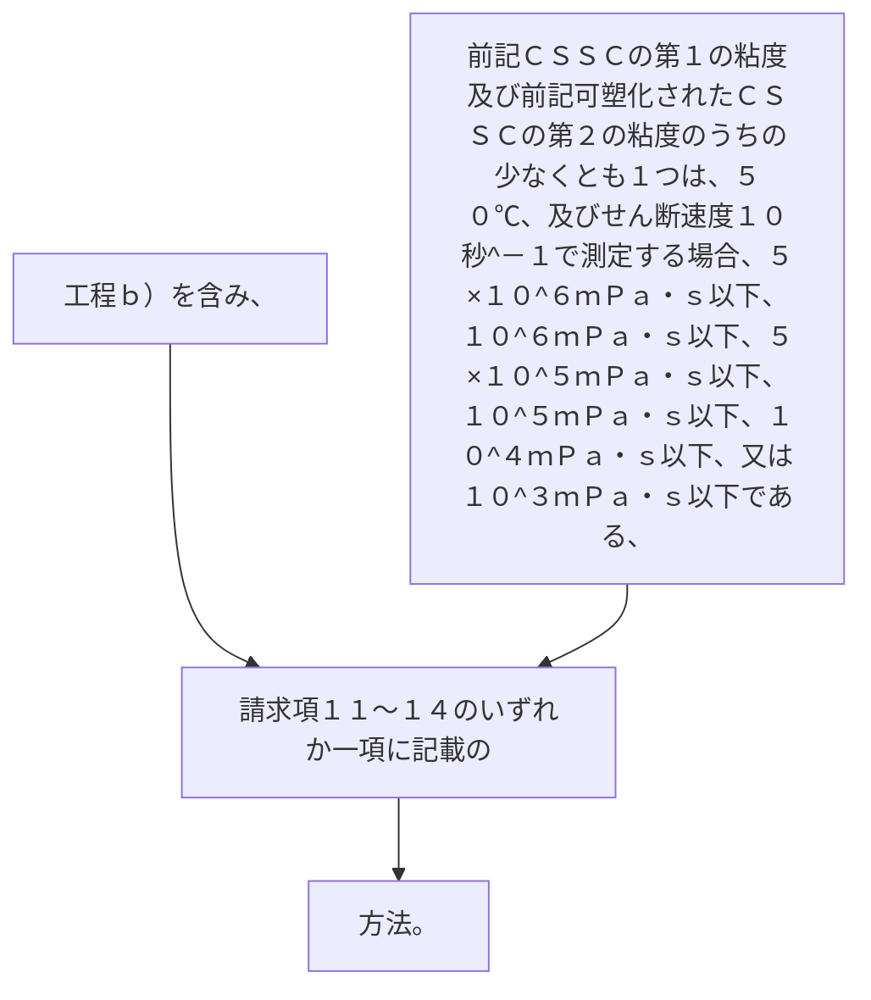

工程ｂ）を含み、かつ前記ＣＳＳＣの第１の粘度及び前記可塑化されたＣＳＳＣの第２の粘度のうちの少なくとも１つは、５０℃、及びせん断速度１０秒
^－１
で測定する場合、５×１０
^６
ｍＰａ・ｓ以下、１０
^６
ｍＰａ・ｓ以下、５×１０
^５
ｍＰａ・ｓ以下、１０
^５
ｍＰａ・ｓ以下、１０
^４
ｍＰａ・ｓ以下、又は１０
^３
ｍＰａ・ｓ以下である、請求項１１～１４のいずれか一項に記載の方法。
